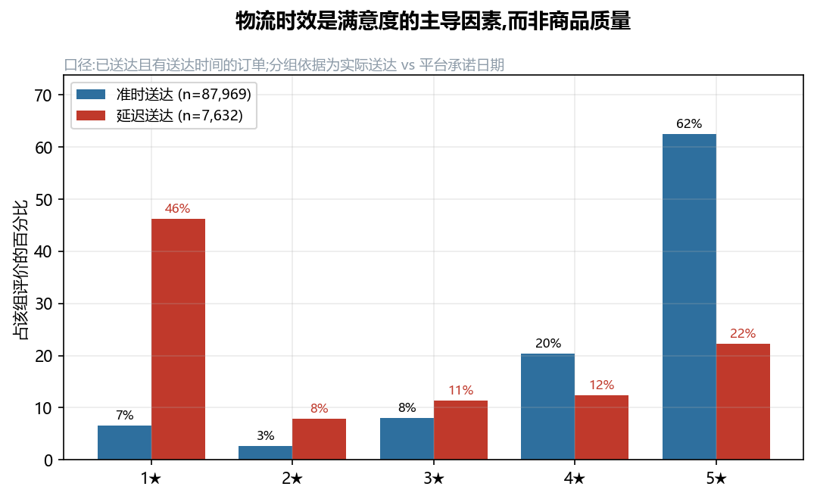
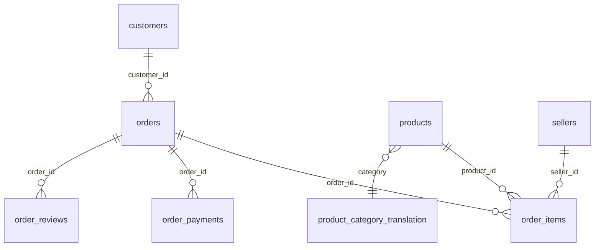
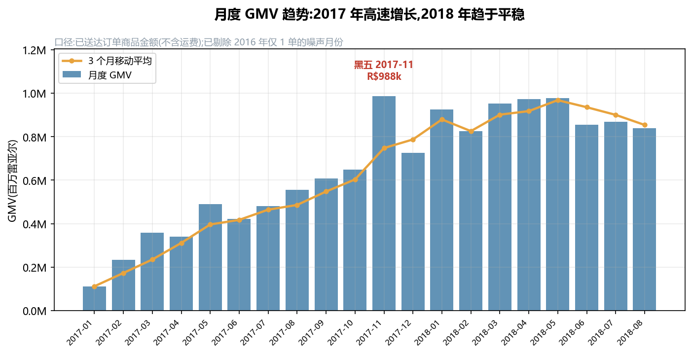
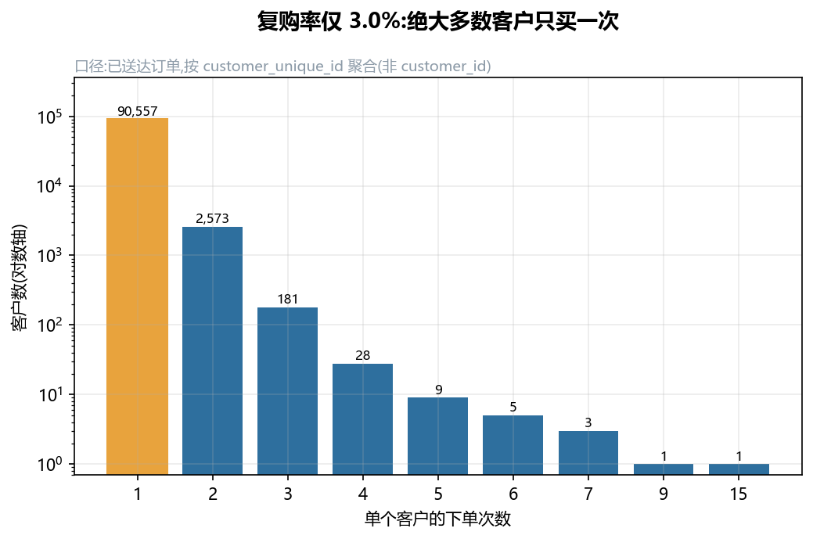
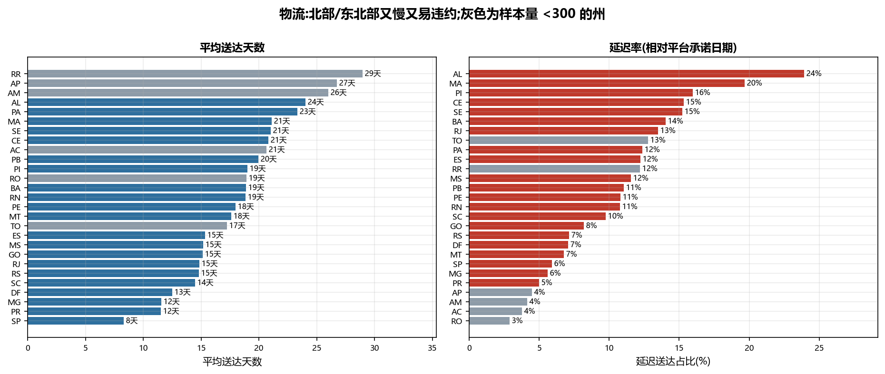
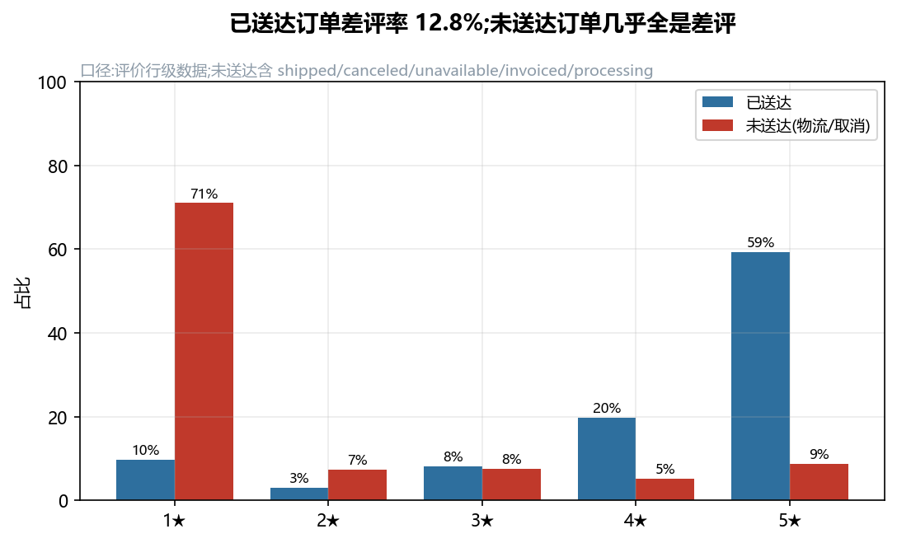
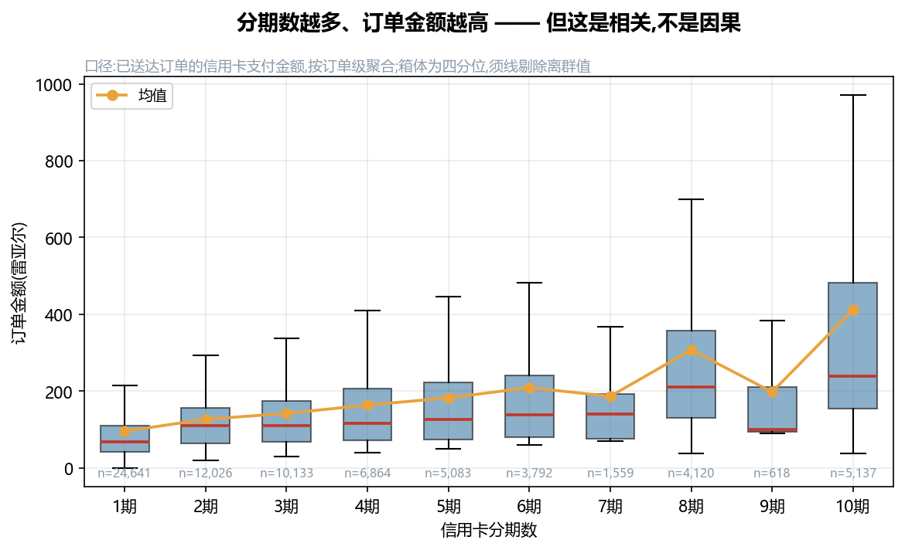
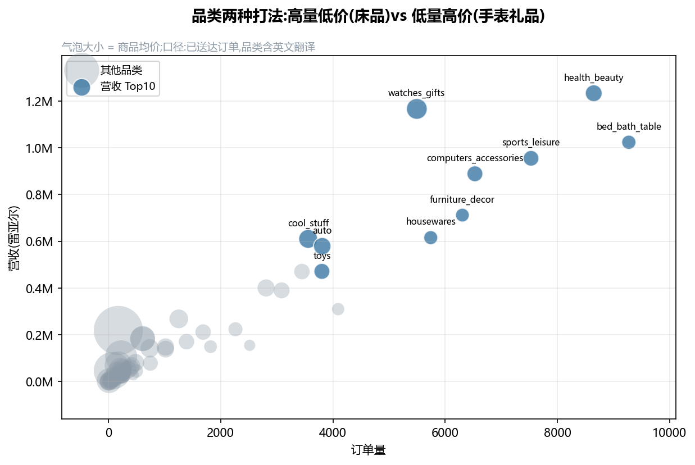

# 巴西电商 Olist 数据分析(Python + MySQL + SQL)

用近 **10 万笔真实订单**回答 6 个业务问题:从 Python 清洗导入 MySQL,用 SQL 做多表关联与窗口函数分析,再用 Python 出图,最后给出**可落地的业务建议**。

> 本项目的每条结论都标注了**口径**和**局限**。数据分析的价值不在于图表好看,而在于结论能被信任、能被追问。

---

## 核心结论:物流时效,而不是商品质量,决定了客户满意度

同一个平台上,把订单按"是否晚于平台承诺日期送达"分组,评价分布差异极大:

| 分组 | 订单数 | 平均评分 | 差评率(1–2★) |
| --- | ---: | ---: | ---: |
| **准时送达** | 87,969 | **4.30** | **9.2%** |
| **延迟送达** | 7,632 | **2.57** | **54.1%** |

延迟订单的差评率是准时订单的 **5.9 倍**。这意味着差评的主要来源不是选品或商品质量,而是**履约**。**建议**:把物流时效作为第一优先级 KPI,对预计延迟的订单**提前主动触达**(改期通知/补偿),而不是等到差评产生后再补救。



---

## 技术栈

| 环节 | 工具 |
| --- | --- |
| 数据清洗 / 导入 | Python(pandas + SQLAlchemy) |
| 数据库 | MySQL 8.0 |
| 分析 | SQL(多表关联、CTE、窗口函数)+ Python(pandas) |
| 可视化 | matplotlib(本仓库内可复现);附 Power BI 搭建指南 |

## 数据来源

Olist Brazilian E-Commerce 公开数据集:2016–2018 年 **99,441 笔**订单,涵盖订单、客户、卖家、商品、支付、评价、物流等 9 张表。

- 官方 Kaggle:<https://www.kaggle.com/datasets/olistbr/brazilian-ecommerce>
- GitHub 镜像:<https://github.com/HNguyennt/Brazilian-E-Commerce-Public-Dataset-by-Olist>

## 表关系(ER 图)



## 目录结构

```
olist-data-analysis/
├── data/raw/                 # 原始 CSV(体积大,不提交,见 .gitignore)
├── etl/
│   ├── config.py             # 数据库配置 + engine(唯一的数据库入口)
│   └── load_data.py          # 清洗 + 导入 MySQL
├── sql/
│   ├── schema.sql            # 建库建表
│   └── analysis_queries.sql  # 6 个业务分析查询(含易错点说明)
├── analysis/
│   ├── run_analysis.py       # 跑全部分析并导出图表
│   └── charts/               # 7 张 PNG 图表(已提交,README 直接引用)
├── powerbi/README.md         # Power BI 连接步骤 + DAX 度量值
├── .env.example              # 数据库配置模板
├── requirements.txt
└── README.md
```

---

## 快速开始

### 1. 准备 MySQL 与数据

安装 MySQL 8.0(本项目用到 `SUM(...) OVER ()` 窗口函数,**5.7 不支持**),下载数据集解压后把 9 个 CSV 放进 `data/raw/`。

### 2. 配置密码(不要写进代码)

```bash
cp .env.example .env      # 然后把真实密码填进 .env
```

`.env` 已被 `.gitignore` 忽略,不会提交。

### 3. 建库建表 + 导入

```bash
pip install -r requirements.txt
mysql -u root -p < sql/schema.sql
python etl/load_data.py
```

### 4. 跑分析并出图

```bash
python analysis/run_analysis.py
```

会在终端打印全部指标,并把 7 张图表写入 `analysis/charts/`。

> 想用 Power BI 做同样的看板,见 [powerbi/README.md](powerbi/README.md)。

---

## 分析结论

### 1. 销售趋势:2017 年爆发,2018 年进入平台期



- 20 个月区间(2017-01 ~ 2018-08)内,月 GMV 从 **R$112k 增长到约 R$839k**。
- **2017-11 是明确的峰值**:7,289 单 / R$987,765(巴西黑五),是 2017-01 的 8.8 倍。
- 2018 年月 GMV 稳定在 **R$826k–978k** 区间,增长趋缓。
- **建议**:大促资源向 Q4 集中;2018 年的平台期提示需要新的增长点(品类扩张或复购运营)。

> 口径:仅已送达订单的商品金额(不含运费)。已剔除 2016-09/2016-12——这两个月各只有 1 单,是上线初期的噪声,会把趋势图压平。

### 2. 客户粘性:复购率仅 3.0%



- 93,358 名客户中,90,557 人(97%)**只下过一次单**,复购客户仅 2,801 人。
- **建议**:拉新成本高而留存极低,应把预算从纯拉新转向**首单后的二次转化**(复购券、关联品类推荐)。

> **局限**:这是**下限**。数据集只有约 2 年窗口,2018 年下半年的新客根本没有足够时间产生复购。

### 3. 物流:北部/东北部又慢又易违约——但"慢"和"违约"是两件事



- **SP(圣保罗)** 最快:8.3 天,延迟率仅 5.9%,贡献 40,494 单(占样本 42%)。
- **RR / AP / AM** 平均送达最久(29 / 27 / 26 天),但**样本量极小(41 / 67 / 145 单)**。
- 关键发现:**平均天数与延迟率并不一致**。AP、AM 平均 26+ 天但延迟率只有 4%(平台给了更长的承诺期);而 **AL(24% 延迟)、MA(20%)、PI/CE/SE(15–16%)** 才是真正**频繁违约**的州。
- **建议**:以**延迟率**(而非平均天数)作为运营考核指标。AL/MA 等州需要重新校准承诺时效或改用更可靠的承运商,避免承诺了做不到。

> 口径:仅已送达且有送达时间的订单。延迟 = 实际送达晚于 `order_estimated_delivery_date`。样本量 <300 的州在图中置灰,不支撑单州结论。

### 4. 满意度:已送达差评率 12.8%,而未送达订单几乎全是差评



- 已送达订单:均分 **4.16**,差评率 **12.8%**。
- 未送达订单:1★ 占 **71%**,processing 状态均分仅 1.28。

| 订单状态 | 评价数 | 平均分 | 差评率 |
| --- | ---: | ---: | ---: |
| delivered | 95,609 | 4.16 | 12.8% |
| shipped | 1,027 | 2.01 | 69.3% |
| canceled | 577 | 1.75 | 78.0% |
| unavailable | 590 | 1.52 | 85.3% |
| invoiced | 308 | 1.62 | 83.1% |
| processing | 294 | 1.28 | 92.5% |

- **建议**:把"未送达/超时未更新状态"作为**主动干预清单**——这些订单的差评几乎注定,提前补偿的成本远低于差评带来的店铺权重损失。

> 口径:评价为**行级**数据(一条评价一行)。主导口径取已送达订单 12.8%;若混入未送达订单会得到 14.6%,会高估履约正常的商品问题。

### 5. 分期与客单价:强相关,但不能说因果



- 1 期均值 R$95.92,10 期均值 R$412.60,整体随期数上升。
- **但这主要是反向因果**:是**高价订单倾向选择分期**,而不是分期把客单价拉高了。
- 同时**并非严格单调**:7 期(R$186.86)低于 6 期(R$209.24),9 期(R$198.03)低于 8 期(R$307.66)。

> **口径**:已送达订单的**信用卡支付金额**,按订单级聚合后再分期数统计——`order_payments` 是行级表(2,961 个订单有多条支付记录),不聚合会把一单算成多单。
> **局限**:箱线图显示各档位分布高度重叠,差异是分布位移而非清晰的分层。**结论只能说到"相关"**,要证明因果需要实验(如分期免息 A/B 测试)。

### 6. 品类:两种打法,不能只看营收排名



| 排名 | 品类 | 营收 | 订单数 | 均价 |
| ---: | --- | ---: | ---: | ---: |
| 1 | health_beauty | R$1,233,132 | 8,647 | R$130.28 |
| 2 | watches_gifts | R$1,166,177 | 5,495 | R$199.04 |
| 3 | bed_bath_table | R$1,023,435 | 9,272 | R$93.44 |
| 4 | sports_leisure | R$954,853 | 7,530 | R$113.25 |
| 5 | computers_accessories | R$888,725 | 6,530 | R$116.26 |

- **高量低价**(bed_bath_table:9,272 单但均价仅 R$93)——靠走量,拼供应链和履约成本。
- **低量高价**(watches_gifts:5,495 单,均价 R$199)——靠溢价,可搭配分期与礼赠场景。
- **建议**:两类品类用不同策略,不能用同一套流量打法。高价品类配合分期降低决策门槛(见结论 5)。
- **未分类商品占营收 1.29%**,即品类维度覆盖约 **98.7%** 的营收,不影响 Top10 结论。

---

## 口径定义与数据说明

公开分析的结论必须能被复现和追问,所以先把口径写清楚:

- **GMV**:已送达订单的**商品成交额,不含运费** = **R$13,221,498.11**,对应 96,478 单。
- **运费**:R$2,198,275.64,占 GMV **16.6%**——占比不低,评估盈利能力时不能忽略。
- **两个客单价,不可混用**:基于商品金额 **R$137.04**;基于付款金额 **R$159.85**。
- **数据自洽性校验**:付款总额 R$15,422,461.77,与（商品 + 运费）R$15,419,773.75 相差 **0.02%**,说明数据内部一致。
- **数据快照截至 2018-10-17**。2018-09 及之后订单尚未完成履约,已排除在趋势外;2018-08 的送达完成率为 97.5%,**基本完整,未做截断处理**。
- 9 张表全部导入;`geolocation`(约 100 万行)非核心分析,默认跳过。
- **订单总数 99,441,其中已送达 96,478(97.0%)**;未送达部分单独在结论 4 呈现。

## 已知局限

- 观察窗口约 2 年,复购率是被低估的下限。
- 分期与客单价是相关关系,不含因果。
- 数据里没有成本、退货、流量来源,无法计算毛利与 ROI。
- 未做统计显著性检验(样本量上万时,微小差异也会"显著",更应关注效应量)。

## License

MIT
